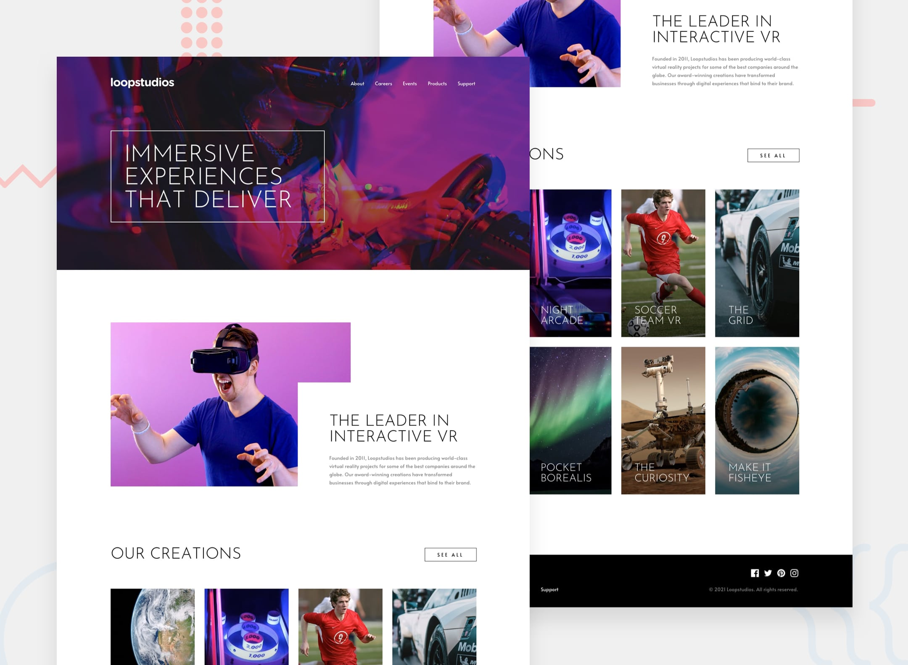

# Frontend Mentor - Loopstudios landing page

## Welcome! 👋

# Frontend Mentor - Loopstudios landing page solution

This is a solution to the [Loopstudios landing page challenge on Frontend Mentor](https://www.frontendmentor.io/challenges/loopstudios-landing-page-N88J5Onjw).

Frontend Mentor challenges help you improve your coding skills by building realistic projects.

<!-- ### Links

- Solution URL: [Add solution URL here](https://your-solution-url.com)
- Live Site URL: [Add live site URL here](https://your-live-site-url.com) -->

### Built with

- Semantic HTML5 markup
- Flexbox
- CSS Grid
- Mobile-first workflow
- Javascript

## My profile at Frontend Mentor

<!-- - Website - [Add your name here](https://www.your-site.com) -->

[@lianpaulm](https://www.frontendmentor.io/profile/lianpaulm)
